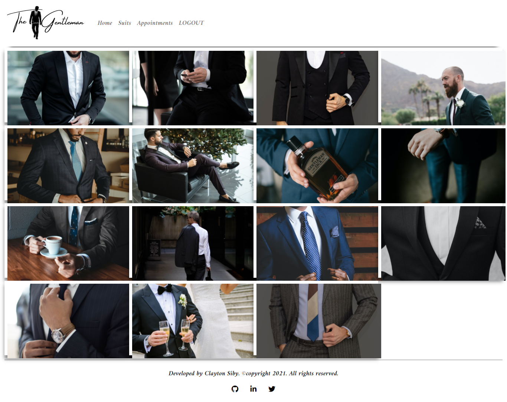

# The Gentleman

This is a web based application built with business specifications. The Gentleman is a full-stack application that serves the purpose of giving users a wide variety of gentleman fashion that they can view and make an appointment to try it on or negotiate with the seller. Authentication is required i.e all users need to register first to view all the gentleman suits on the site. The application makes use of [The Gentleman API](https://github.com/ClaytonSiby/gentleman-api/tree/feature/gentleman) to authenticate and authorize users and give them access to the resources available on the various endpoints provided. For authentication and authorization, I made use of the JWT standard that generates an auth token to register or login users. For a visual demo of the app in use, please navigate to the Project Design section and get familiar with how to navigate on different routes.

This project follows a [design](https://www.behance.net/gallery/26425031/Vespa-Responsive-Redesign) on behance created by [Murat Korkmaz](https://www.behance.net/muratk).

Built with react on the front-end and rails on the backend.

## Technologies used:
> technologies used in building this project include but are not limited to: 
- reactJS/Redux
- EcmaScript 6
- Bootstrap
- react-test-renderer
- react-testing-library
- buildpack
- netlify
- localStorage
- react-router-dom
- axios

## Project Presentation:
[Video Presentation](https://www.loom.com/share/02b857a8d72046fd93cc59957eab33ac)
## Application Production Link
[The Gentleman](https://the-gentleman.netlify.app/)

## Project Design

## API Repository
[The Gentleman API](https://github.com/ClaytonSiby/gentleman-api/tree/feature/gentleman)

## API Documentation
[The Gentleman API Documentation](https://documenter.getpostman.com/view/13879644/TzRRBnep)

## Project SetUp
You can clone the project on your local machine by running:

- `git clone https://github.com/ClaytonSiby/the-gentleman-app.git`
then:
-  `cd the-gentleman-app`

### install all dependencies by running:
- `yarn install`

- you can run all tests for this project using `yarn test` from the command line.
- you can view the project live by runnig `yarn start`
- for production release/deployment run `yarn build` to bundle a minified version of the code.

## Author 

👤 **Clayton Siby**

- Github: [@ClaytonSiby](https://github.com/ClaytonSiby)
   
- Linkedin: [Linkedin Profile](https://www.linkedin.com/in/clayton-siby-48a8a0183/)

- Twitter: [@Twitter](https://twitter.com/ClaytonSiby)

## :+1: Acknowledgements
-> The success of this project is possible thanks to the platforms and people listed below and more:
- [stackoverflow](https://stackoverflow.com/)
- [microverse](https://microverse.org)
- [the dev community](https://dev.to/)
- [medium](https://medium.com)
- [Murat Korkmaz](https://www.behance.net/muratk)

## :handshake: Contributing 

* Contributions, issues and feature requests are welcome! Feel free to check the [issues page](https://github.com/ClaytonSiby/the-gentleman-app/issues)
- To contribute to this project:
- Fork this repository & clone locally.
- Create an upstream remote and sync your local copy.
- Create a new branch.
- Push your code to your origin repository.
- Create a new Pull Request .

## Show your support

Give a ⭐️ if you like this project!